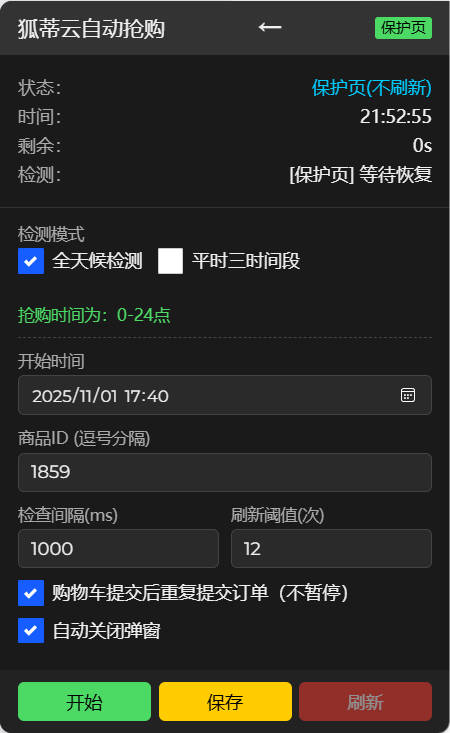
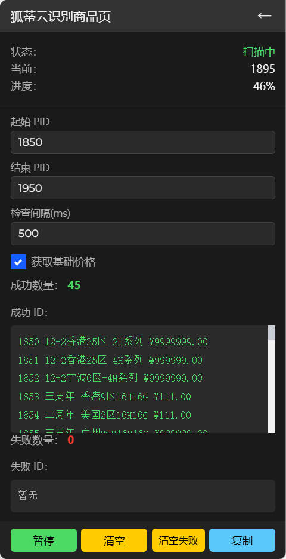
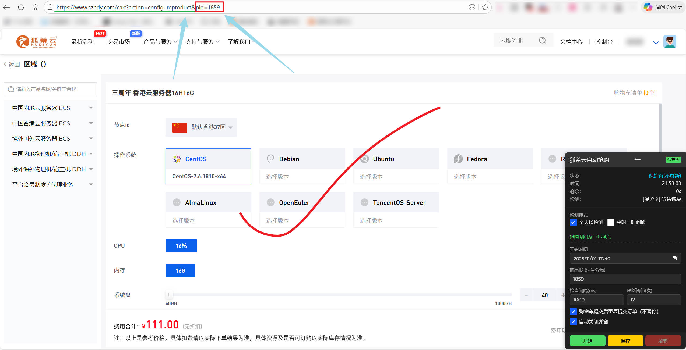

## 狐蒂云自动化脚本

用于狐蒂云（szhdy.com）的自动化工具集，包含自动抢购和商品识别两个脚本。

  
   

#### 项目特点

纯前端脚本，无需后端 
数据存储在浏览器 localStorage 
通过 DOM 操作实现自动化 
支持页面跳转、弹窗关闭、错误重试等 

## 安装说明

1. 安装浏览器扩展 [Tampermonkey](https://www.tampermonkey.net/)
2. 打开 Tampermonkey 管理面板
3. 创建新脚本，复制对应脚本的完整代码并保存
4. 访问狐蒂云网站，脚本会自动运行

## ⚠️注意事项（必读）

- 不要同时运行两个脚本（识别.js 与 抢购.js），避免页面跳转与状态冲突
- 抢购脚本在基于三周年活动编写时只针对“页面默认配置”下单，不支持自动选择具体配置项
- 购物车可能出现重复订单：需手动删除多余订单，保留一个；进入有确认条款的购物车页后再启用抢购脚本可自动重复提交
- 抢购脚本进入“支付页”会自动暂停（可选重复提交）
- 若长时间未检测到目标，脚本会按阈值自动刷新页面；请合理设置检查间隔与刷新阈值

## 使用教程

### 流程总览

1. 先“识别”出有效商品 PID → 2) 再“抢购”这些 PID。

### 商品识别.js（先运行，可选）

目标：在一段 PID 范围内，自动跳转判定哪些是有效商品配置页，并可记录标题/价格。

操作步骤：

1. 打开任意商品页面，启动识别脚本，面板中设置：
   - 起始 PID、结束 PID
   - 检查间隔（默认 500ms）
   - 可选：勾选“获取基础价格”
2. 点击“开始”后脚本会逐个跳转检测；成功项将记录为“PID 标题 价格”并显示在面板
3. 随时可“复制/清空成功”，“清空失败”

提示：出现 404/502 等错误，脚本会先自动重试一次，仍失败才计入“失败列表”。数据持久化于 `localStorage`。

最近的三周年活动香港PID：1859，地址：
https://www.szhdy.com/cart?action=configureproduct&pid=1859

其他商品PID：

点击展开

1951 越南1区|精品网络| 2H系列 ¥25.00 
1952 越南1区|精品网络| 4H系列 ¥40.00 
1953 越南1区|精品网络| 8H系列 ¥70.00 
1954 越南1区|精品网络| 16H系列 ¥120.00 
1955 越南1区|精品网络| 32H系列 ¥350.00 
1956 马来西亚1区|精品网络| 2H系列 ¥25.00 
1957 马来西亚1区|精品网络| 4H系列 ¥40.00 
1958 马来西亚1区|精品网络| 8H系列 ¥70.00 
1959 马来西亚1区|精品网络| 16H系列 ¥120.00 
1960 马来西亚1区|精品网络| 32H系列 ¥350.00 
1961 深圳1区8H8G(YJ) ¥99999999.99 
1962 双十二 香港云服务器12H12G ¥222.00 
1963 双十二 日本云服务器12H12G ¥222.00 
1964 双十二 新加坡云服务器12H12G ¥99999999 
1965 双十二 越南云服务器12H12G ¥999999.00
1966 双十二 马来西亚云服务器12H12G ¥999999 
1967 佛山2区16H16G-严禁转移版(YJ) ¥999999. 
1968 双十二 佛山2区12H12G ¥550.00 
1969 双十二 广州BGP12H12G ¥300.00 
1970 双十二 香港云服务器12H12G ¥121.20 
1973 香港50区|精品网络| 2H系列 ¥30.00 
1974 香港50区|精品网络| 4H系列 ¥70.00 
1975 香港50区|精品网络| 8H系列 ¥150.00 
1976 香港50区|精品网络| 16H系列 ¥300.00 
1977 香港50区|精品网络| 32H系列 ¥500.00 
1978 深圳南山电信3区-4H系列 ¥200.00 
1979 深圳南山电信3区-8H系列 ¥399.00 
1980 深圳南山电信3区-16H系列 ¥700.00 
1981 深圳南山电信3区-32H系列 ¥1300.00 
1982 广州BGP3区-4H系列 ¥60.00 
1983 广州BGP3区-8H系列 ¥100.00 
1984 广州BGP3区-16H系列 ¥200.00 
1985 广州BGP3区-32H系列 ¥400.00 
1987 广州BGP3区-8H8G(YJ) ¥99999.00 
1988 2026元旦 香港CTG云服务器A ¥999999.00 
1989 2026元旦 香港CTG云服务器B ¥9999999.00 
1990 2026元旦 日本云服务器 ¥999999.00 
1991 2026元旦 深圳电信4区云服务器 ¥9999999.00 
1992 美国21区2H2G(YJ) ¥99999999.00 
1993 法兰克福1区-2H系列 ¥35.00 
1994 法兰克福1区-4H系列 ¥45.00 
1995 法兰克福1区-8H系列 ¥70.00 
1996 法兰克福1区-16H系列 ¥150.00 
1997 法兰克福1区-32H系列 ¥400.00 
1998 春节美国8区云服务器 ¥188.00 
1999 春节香港52区云服务器 ¥19.90 
2000 春节深圳电信4区云服务器 ¥50.00 
2001 春节宁波4区云服务器 ¥50.00 
2002 春节北京BGP3区云服务器 ¥50.00 
2003 春节美国云服务器A ¥999999.00 
2004 春节美国云服务器B ¥99999.00 
2005 春节香港52区云服务器B ¥99999.00 
2006 春节宁波4区云服务器B ¥99999999.00 
2007 2026 佛山2区16H16G(YJ) ¥999999.00 
2008 春节香港53区云服务器 ¥999999.00 
2009 春节香港云服务器120 ¥120.26 
2010 2026 香港24区4H4G(YJ) ¥999999.00 
2011 春节德国云服务器 ¥999999.00 
2012 春节日本云服务器 ¥9999999.00 
2013 春节广州云服务器 ¥288.00 
2014 2026 潮州5区8H8G(YJ) ¥99999999.00 
2015 2026 香港14区16H16G(YJ) ¥15999.00 
2016 2026 常州16H16G(YJ) ¥99999999.99 
2017 春节香港54区云服务器3旧 ¥99999999.00 
2018 春节美国云服务器AB ¥9999999.00 
2019 西安电信8区-4H系列 ¥50.00 
2020 西安电信8区-8H系列 ¥100.00 
2021 西安电信8区-16H系列 ¥200.00 
2022 西安电信8区8H8G(YJ) ¥9999999.00 
2023 西安电信8区16H16G(YJ) ¥9999999.00 
2024 西安电信8区4H4G(YJ) ¥9999999.00 
2025 春节香港54区云服务器19 ¥19.90 
2026 春节襄阳云服务器 ¥520.26 
2027 2026 佛山1区8H8G(YJ) ¥999999.00 
2028 内蒙古1区-4H系列 ¥40.00 
2029 内蒙古1区-8H系列 ¥70.00 
2030 内蒙古1区-16H系列 ¥100.00 
2031 内蒙古1区-32H系列 ¥300.00 
2032 内蒙古2区-4H系列 ¥40.00 
2033 内蒙古2区-8H系列 ¥70.00 
2034 内蒙古2区-16H系列 ¥100.00 
2035 内蒙古2区-32H系列 ¥300.00 
2036 北京电信1区-4H系列 ¥60.00 
2037 北京电信1区-8H系列 ¥100.00 
2038 北京电信1区-16H系列 ¥200.00 
2039 北京电信1区-32H系列 ¥400.00 
2040 2026 云服务器32H32G(YJ6) ¥9999999.00 
2041 2026 云服务器32H32G(YJ5) ¥9999999.00 
2042 2026 云服务器8H8G(YJ6) ¥9999999.00 
2043 十年之约 香港云服务器 ¥888.00 
2044 2026 云服务器2H2G(YJ7) ¥9999999.00 
2045 2026 云服务器8H8G(YJ3) ¥99999999.00 
2046 2026 云服务器2H2G(YJ5) ¥9999999.00 
2047 2026 云服务器8H8G(YJ5) ¥9999999.00 
2048 春节香港云服务器3 ¥188.00 
2049 美国35区|精品网络| 2H系列 ¥30.00 
2050 美国35区|精品网络| 4H系列 ¥50.00 
2051 美国35区|精品网络| 8H系列 ¥90.00 
2052 美国35区|精品网络| 16H系列 ¥150.00 
2053 美国35区|精品网络| 32H系列 ¥300.00 
2055 2026 云服务器16H16G(YJ3) ¥99999999.00 
2056 型号A 香港2H2G云服务器 ¥9999999.00 
2057 型号B 香港4H4G云服务器 ¥9999999.00 
2058 型号C 香港4H4G云服务器 ¥9999999.00 
2059 型号D香港4H4G云服务器 ¥9999999.00 
2060 型号E 香港4H4G云服务器 ¥9999999.00 
2061 型号F 香港8H8G云服务器 ¥9999999.00 
2062 型号G 香港8H8G云服务器 ¥99999999.00 
2063 型号H 香港8H8G云服务器 ¥9999999.00 
2064 型号I 香港8H8G云服务器 ¥99999999.00 
2065 香港云服务器49.9 ¥49.90 
2066 美国云服务器49.9 ¥49.90 

2026.2.9 春节活动更新~
⚠️脚本还能继续兼容，不过因为多了个支付方式，需要提前往账号充值资金！！⚠️

### 自动抢购.js（后运行）

目标：在指定检测策略与商品 PID 列表下，循环检测可购即自动点击购买/提交。

操作步骤：

1. 将识别得到的 PID 粘贴到“商品 ID（逗号分隔）”
2. 选择检测模式：
   - 全天候（all_day）：0-24h 持续检测
   - 三时间段（three_periods）：每日 7-9/13-14/17-19 运行
3. 设置检查间隔（默认 800ms）与“刷新阈值”（默认 5 次失败后刷新）
4. 可选：开启“购物车提交后重复提交”“自动关闭弹窗”“侧栏模式”
5. 点击“开始”，面板会显示状态/倒计时/失败计数

⚠️注意⚠️ 
建议直接在已知的具体商品页面运行抢购.js，因不可控的活动页面变化，不要在活动列表页面使用！

行为规则：

- 支付页：自动暂停，不再执行任何点击(此刻才算锁单了)
- 购物车页：自动勾选支付/条款并提交（可选重复提交）
- 保护页（配置页）：不刷新，只做必要点击（如加入购物车）
- 普通商品列表：依据 `pid/gid` 或 `[data-id]/[data-gid]` 定位按钮自动点击

## 常见问题

- 看不到(没有)自动点击？
  - 检查页面是否能找到以下任一元素：
    - `.form-footer-butt[href*="pid=目标ID"]`
    - `[data-id="目标ID"] .form-footer-butt`
    - `a[href*="gid=目标ID"]`
- 识别脚本没记录标题/价格？
  - 标题/价格选择器会因活动样式变化失效，建议先只拿 PID，再人工核验
- 数据保存在哪里？
  - 抢购配置：`hudiyun_config`；抢购运行状态：`hudiyun_running`
  - 识别配置：`hudiyun_scanner_config`；成功：`hudiyun_scanner_success`；失败：`hudiyun_scanner_failed`

## 致谢与声明

- 本项目基于群友脚本拓展开发，仅用于学习与技术研究，请遵守网站规则与当地法律
- 祝大家都能买到需要的服务器
